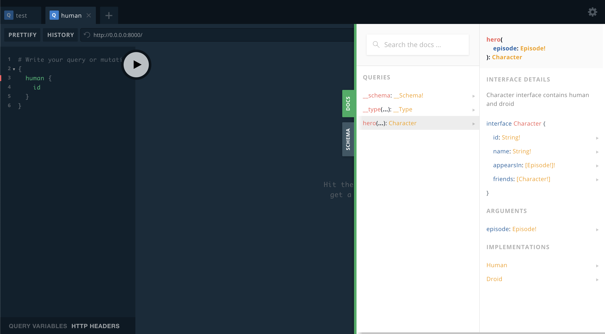

Pygraphy supports GraphQL introspection, and it has already integrated the [GraphQL Playground](https://github.com/prisma/graphql-playground). Try to run the web server which is posted in the quick review at [Introduction](/) and visit [http://0.0.0.0:8000](http://0.0.0.0:8000) by a browser, then you can enjoy the playground in developing.

The schema of Introspection are totally wrote with Pygraphy itself: [pygraphy/introspection.py](https://github.com/ethe/pygraphy/blob/master/pygraphy/introspection.py), which proves that Pygraphy has a powerful schema declaration availability.
